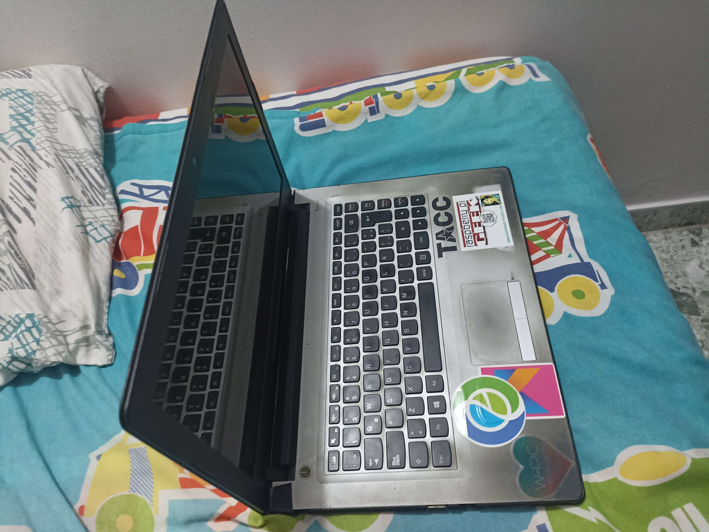
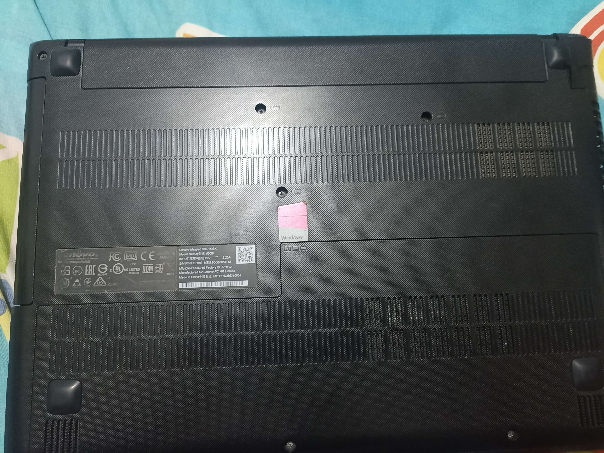

# Turning old laptop into a server project

On this repo I upload the files created on my own journey of turning an old laptop into a server. Theses files may be config files, docker files, etc... 
My main motivation for doing this is that I have got an old laptop that wasn't turn on in a while and I was wondering if it may be useful anyhow.

## Laptop specs
- **CPU:** Intel pentium 
- **RAM:** 6 GB RAM DDR3
- **Storage:** 512 GB SSD SATA
- **Model:** Lenovo ideapad 300-14ISK

| Laptop  | Model |
| ------------- | ------------- |
|   |   |

## Setting the environment
For this project I used [Ubuntu Server 24.04](https://ubuntu.com/download/server). To install it, I did:
- The first thing is to create a booteable USB with ubuntu server.
- When installing it on the laptop, it's important to uncheck the option **Set up this disk as an LVM group**.
- Procceed with the installation.

When the installation is finished, it's necessary to set up an internet connection due to the device needs to connect to internet to install everything.  
I want to access using Wifi, so I had to do some extra steps:
- `ip link` display the network interface names. The one that start with W is the interface for WiFi (for example *wlan0*).
- `ip link set WIFI_INTERFACE_NAME up` activate the interface (if it's not activated).
- `iwlist WIFI_INTERFACE_NAME scan` scan WiFi networks available.
- Use `wpa_passphrase WIFI_NETWORK PASSWORD > /etc/wifi` to save config of a network on /etc/wifi.
- Use `wpa_supplicant -B -i WIFI_INTERFACE_NAME -D wext -c /etc/wifi` to connect.

After doing all above, I have done the basics to start setting up the server!
