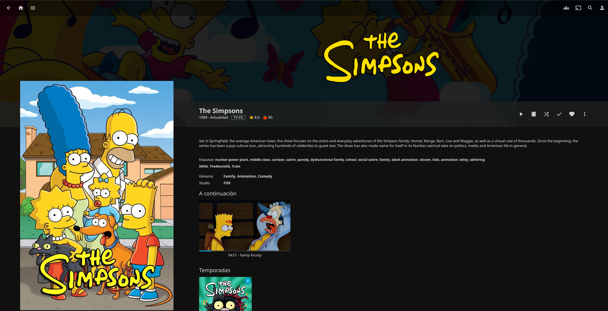

# Media service using Jellyfin
Jellyfin enables you to collect, manage, and stream your media. It's perfect for a media service where I can watch my favorites TV shows, movies, animes, etc.
<br>It is really a good idea to implement this on the server!


I had some troubles installing this service directly on the server using the package tool. So thought that the best option to avoid headaches was using **Docker**.
The only thing to do is to create the `docker-compose.yml` file to run docker compose, so I created a directory which to it. I named it jellyfin.
``` 
version: "3.3"

services:

  jellyfin:
    image: linuxserver/jellyfin
    container_name: jellyfin
    restart: unless-stopped 
    ports:
      - "8096:8096"
    environment:
      - PUID=1000
      - PGID=1000
      - TZ=Etc/UTC
    volumes:
      - ./config:/config
      - ./series:/data/tvshows  
      - ./movies:/data/movies   
      - ./music:/data/music
``` 
In the same directory of the docker compose file, I created a folder name Series that contains 4 episodes of season six of The Simpsons to test the service.
Then just ran the `docker compose up` command and the service got up. <br>To enter, just need the ip address and the port number. When the admin user was created, I was able to watch the folder that contained The Simpsons on it.

