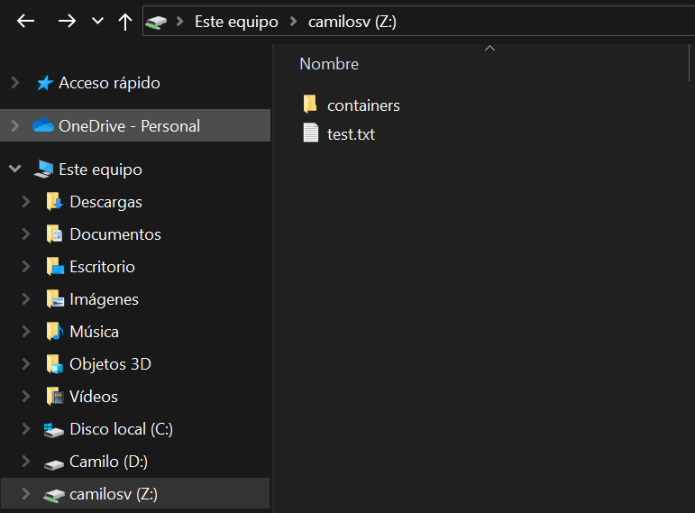

# Network storage service using Samba

Samba is the standard Windows interoperability suite of programs for Linux and Unix, that means Samba allows Linux and Unix systems to interact and work seamlessly with Windows systems. <br>
I want to share files from my main PC to other devices.

To install Samba on the server just type `sudo apt install samba`. Once installed the only thing left is to configure the envoriment where the files will ve located. For this I followed:
- Create a directory `/media/myfiles`
- Change the permissions of the directory using `sudo chown $USER: /media/myfiles`
- Change configuration line `map to guest = bad users` to `map to guest = never` on `/etc/samba/smb.conf`
- On the same configuration file add the path of stored files:
```
[myfiles]
    path = /media/myfiles
    writeable=yes
    public=no
``` 
- Set a password using `smbpasswd -a userName`
- Restart samba service `sudo systemctl restart smbd`

Samba is configured and ready to connect from external devices. For Windows go to the **File Explorer** > **This PC**. Right click and select **Map Network Drive**, type `\\SERVER_IP\\folder` something like `\\192.168.68.133\myfiles`
<br>Enter username and password. Now it is possible to store files on that directory.

